# Plataforma para Corredores de Bolsa

## Descripción
Este proyecto corresponde al examen final de certificacion del bootcamp "DESARROLLO DE APLICACIONES FULL STACK PYTHON TRAINEE V2.0" llamado Corredores de Bolsa donde se evaluaran las habilidades y conocimientos adquiridos durante el Bootcamp.

## Requerimientos

- WSL // Ubuntu
- Django 5.1.3
- Python 3.12+
- PostgreSQL

## Funcionalidad en el Panel de vista web

- Autenticación de usuarios (Iniciar sesión/Salir)
- Comercio de acciones (Comprar/Vender)
- Gestión de perfil de usuario (Password defecto `0p9o8i7u.`)

## Pasos para el montaje

1. **Crear nuestra base de datos**:
    Ingresamos a nuestra shell de psql o bien desde nuestro PGAdmin y creamos nuestra Base de datos con el nombre del proyecto "corredore_bolsa" y creamos nuestro usuario llamado pathuser.

    GUI

    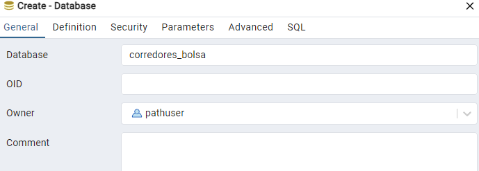

    CLI

   ```bash
   sudo -u postgres psql
   postgres=# CREATE DATABASE corredores_bolsa;
   postgres=# CREATE USER pathuser WITH PASSWORD 'tu_contraseña_segura';
   postgres=# GRANT ALL PRIVILEGES ON DATABASE corredores_bolsa TO pathuser;
   postgres=# \q 


2. **Configuración de la Base de Datos**:

    - Crea la base de datos en PostgreSQL.
    - Configura DATABASES en settings.py.

3. **Migraciones**: 
    Ejecuta las migraciones para crear las tablas en la base de datos:

        ```bash
        python manage.py migrate

4. **Crear un Superusuario**: 
    Para acceder al panel de administración:

    ```bash
    python manage.py createsuperuser

5. **Injectar Datos a la Base de datos**: 
    Ejecutar en el siguiente orden:

    ```bash
    python manage.py loaddata cbolsa/fixtures/usuarios.json
    python manage.py loaddata cbolsa/fixtures/accion.json
    python manage.py loaddata cbolsa/fixtures/transaccion.json

6. **Iniciar el Servidor**: 
    Ejecuta el servidor de desarrollo de Django:

    ```bash
    python manage.py runserver

7. **Acceder al Panel de Admin**: 
    Visita http://127.0.0.1:8000/ para acceder e interectuar con los distintos operadores.


---

## **Resultados**
Este proyecto ahora está listo para ser probado y lanzado en un entorno de producción con un diseño moderno, funcionalidades clave implementadas, y configurado para escalar en el futuro si es necesario.


### Print de los resultados

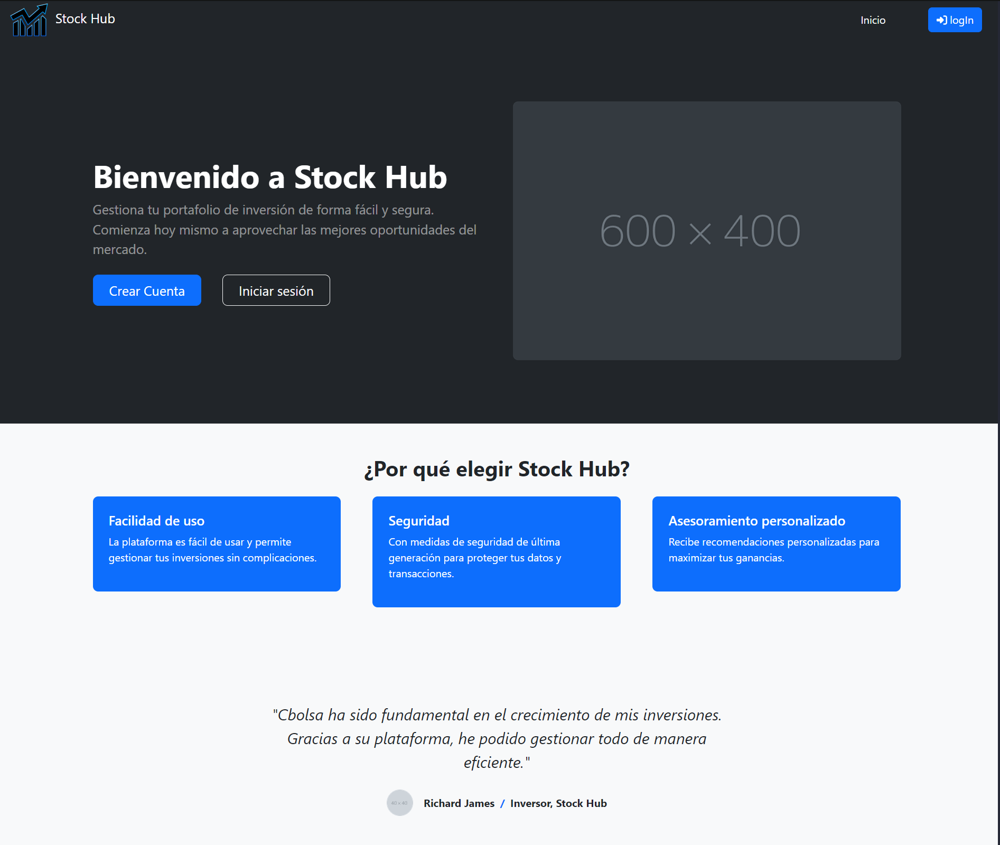

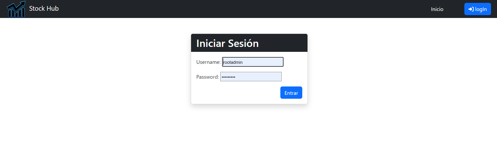

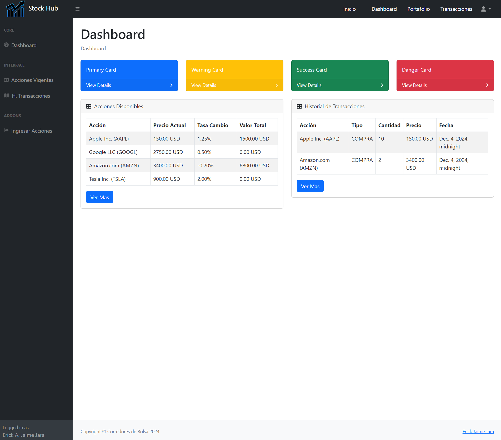

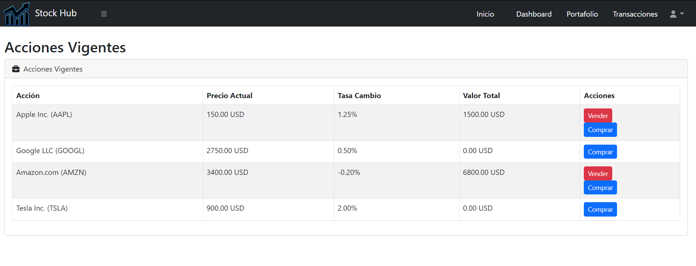

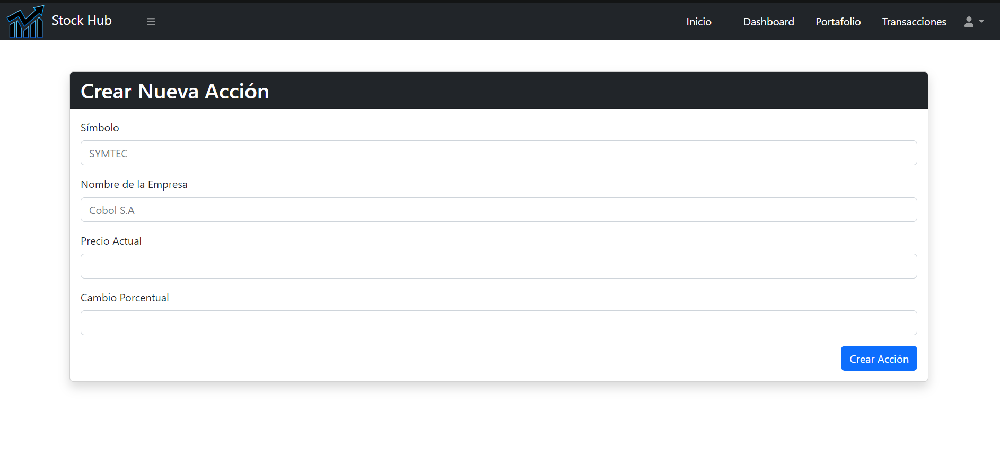

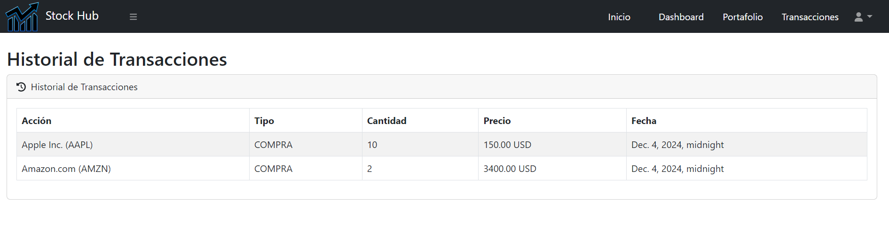

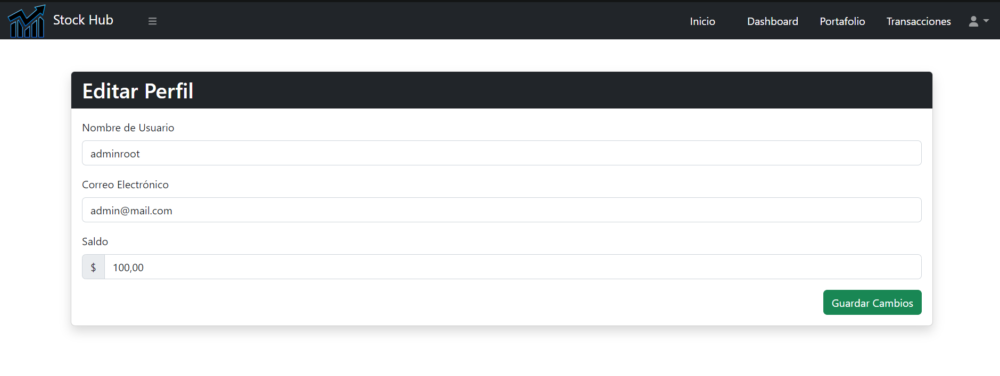

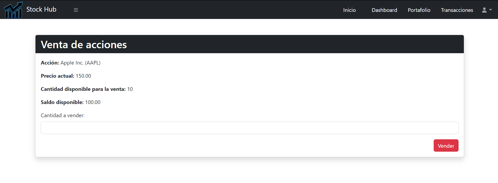

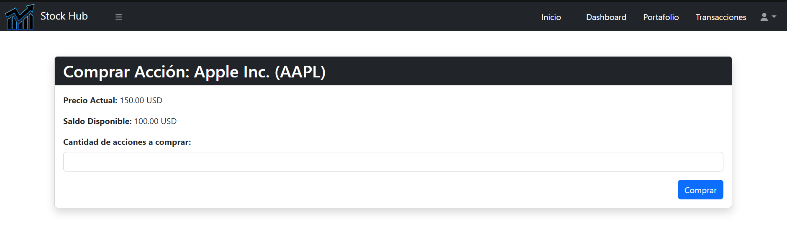

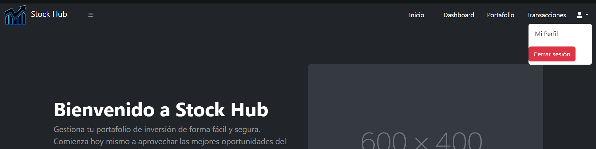

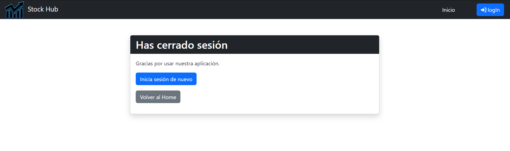

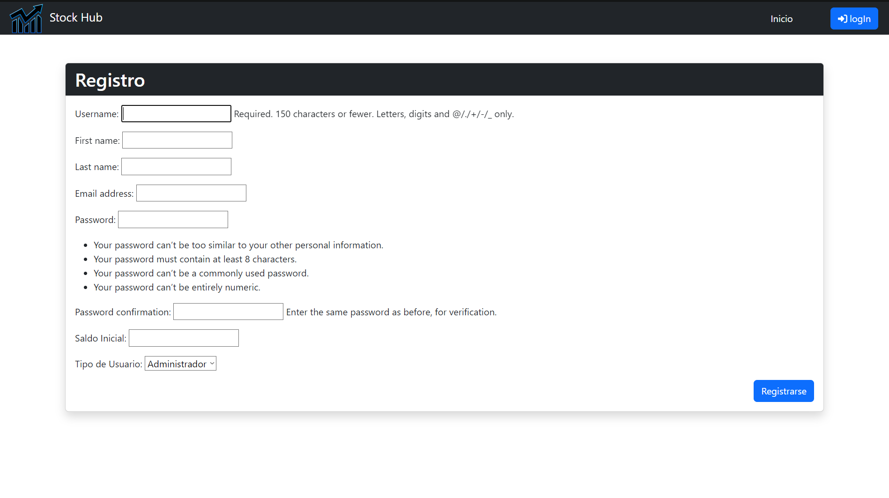


Autor
Nombre: [Erick-Jaime-Jara]
Correo: [alucard.erick.mega@gmail.com]